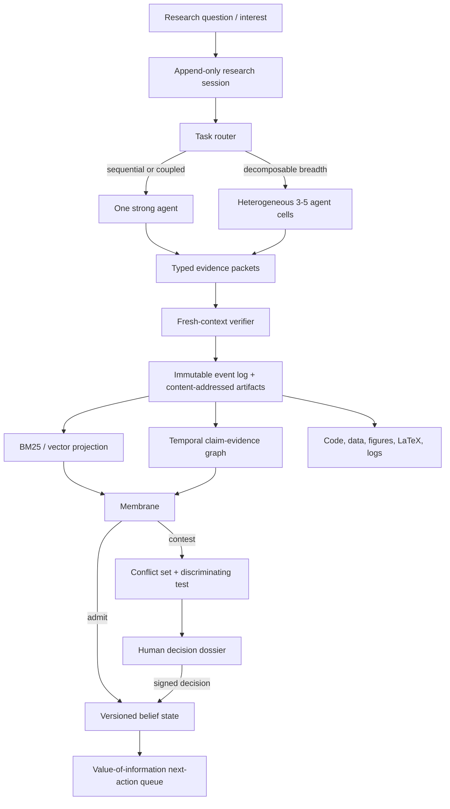

# Persona Research Quality Program

**Living document — 2026-07-11.** Update this file when evidence changes a decision. Raw run notes go in `docs/BUILD_NOTES.md`; numeric results and reversals go in `results/FINDINGS.md`.

## 1. Outcome

Persona will become a persistent epistemic collaborator for human research teams. It will not compete with general scientific workbenches by adding more buttons. Its narrow, defensible contribution is to preserve how a field's claims, contradictions, hypotheses, tests, and decisions evolve over time, then choose the next action with the highest expected information value.

Every scientific conclusion must be inspectable as:

```text
question
  -> atomic claim
      -> exact source span + stable source identifier
      -> qualifiers: population, intervention, outcome, method, conditions
      -> support / refute / qualify / replicate / extend edges
      -> derivation or executable test
      -> uncertainty and provenance state
  -> next discriminating action or human decision dossier
```

Persona stores public rationale, tool calls, code, outputs, and artifacts. It does **not** pretend to recover a model's private chain of thought.

## 2. Evidence that changes the design

### Current Persona audit — observed locally

| Finding | Evidence | Consequence |
|---|---|---|
| Malformed self update | `personas/curie-3c33/self/open_questions.md` contains 315 one-character bullets. `selfmind.set_open_questions()` accepts any iterable; `deliberate()` writes model output without validating its type. | Validate the model/tool payload once at the self write boundary; preserve and migrate the damaged file. |
| False contradiction | A live Curie contradiction stores opposing signs although both source quotes say microglial activation exacerbates tau pathology. | A sign collision is only a **candidate conflict**. Exact spans, compatible qualifiers, and an independent contradiction verifier must gate human escalation. |
| Misleading convergence | 47 of the first 200 displayed beliefs have one source, while the UI labels the collection “converged.” | Never infer epistemic state in the client. Render explicit server states: observed, corroborated, contested, anchored, tested. |
| Hidden spend | `GET /topic/digest` invokes a model and changed the budget during two audit reads. | GET becomes read-only. Generation moves to an explicit POST and produces a durable artifact. |
| Uncited analysis | The existing aging/genetics analysis reports scientific quantities and conclusions without source claim IDs even though the graph contains sources. | A session cannot finalize a conclusion without evidence IDs or an explicit `UNSUPPORTED_HYPOTHESIS` state. |
| Activity is not reasoning | In the latest 500 events: 217 spawn, 197 lease, 65 thought, 21 schedule. The UI replays the last 80 and adds ambient fake readers. | The notebook derives a scientific event stream and hides scheduler telemetry by default. No simulated activity. |
| Evolution is not evolution | The UI visualizes graph ingest edges rather than `/history`; its “VoI” and “load-bearing” scores are client-side degree heuristics. | Use temporal belief history and server-computed, versioned metrics; label unvalidated heuristics as candidates. |
| Knowledge surfaces are disconnected | `/fieldmap` exists and returned 40 subtopics, but the current interface does not call it. `/kg` returns 378 KB and `/files` 344 KB in one request. | Restore the useful field map behind progressive drill-down; paginate/summarize large payloads. |
| Cross-persona state leak | `openMind` does not clear `FS.tree` or `window.__kg`; `openBrain` retains the cached tree. | Reset persona-scoped caches on selection. |
| No durable research session | `runs/` is empty; no API or UI represents a session evidence/code/artifact lineage. | Make an append-only session record the unit of scientific work. |

### External evidence — primary and official sources

- [Karpathy's autoresearch](https://github.com/karpathy/autoresearch) demonstrates the right narrow self-improvement harness: one mutable program, immutable evaluator, fixed wall-clock budget, automatic keep/revert, and a durable result log. It is a harness pattern, not evidence that unconstrained research self-improves.
- [Anthropic's multi-agent research system](https://www.anthropic.com/engineering/multi-agent-research-system) reports that orchestrated breadth-first research can outperform one agent, but uses about 15 times the chat tokens. Its useful primitives are explicit worker contracts, parallel independent search, a citation pass, and evaluation on outcomes rather than agent narration.
- [Towards a Science of Scaling Agent Systems](https://research.google/blog/towards-a-science-of-scaling-agent-systems-when-and-why-agent-systems-work/) reports that topology must match task structure: central coordination helped a parallel task, while every tested multi-agent design degraded a sequential planning task. Persona must route tasks; it must not equate agent count with intelligence.
- [MacNet](https://openreview.net/forum?id=K3n5jPkrU6) shows that DAG orchestration can technically scale beyond 1,000 agents and that topology matters. It does not establish an equal-compute benefit from 1,000 agents.
- [PaperQA2](https://arxiv.org/abs/2409.13740) supports retrieval followed by reranking, contextual summaries, citation traversal, and claim-level citation validation. Its contradiction results also reinforce that conflict detection is a surfacing step, not truth.
- [OpenScholar](https://arxiv.org/abs/2411.14199) supports iterative retrieval and self-feedback over a large passage index, while documenting how frequently an ungrounded frontier model can fabricate citations.
- [HippoRAG 2](https://arxiv.org/abs/2502.14802) and [Mem0](https://arxiv.org/abs/2504.19413) support a hybrid graph-plus-passage memory. Neither supports making a knowledge graph the sole source of truth.
- [Anthropic Managed Agents](https://www.anthropic.com/engineering/managed-agents) supports an append-only session log outside model context, a replaceable harness, disposable sandboxes, and credentials outside those sandboxes.
- [DR Tulu](https://allenai.org/blog/dr-tulu) provides a concrete open-model learning recipe: filtered SFT, then multi-rollout GRPO/RLER with separate research-quality, citation, format, and tool rewards. Hosted Claude models do not expose a public customer weight-training path; Persona will optimize their prompts, tools, memory, and harness, and reserve SFT/RL for open weights.
- [Agent Lightning](https://arxiv.org/abs/2508.03680) motivates recording every agent call as a trajectory of state, action, observation, and reward so later credit assignment is possible.
- [Google's AI co-scientist](https://deepmind.google/blog/co-scientist-a-multi-agent-ai-partner-to-accelerate-research/) supports generation, reflection, ranking, evolution, and verification-heavy hypothesis tournaments. Verification receives more compute than ideation.
- [AlphaEvolve](https://deepmind.google/blog/alphaevolve-a-gemini-powered-coding-agent-for-designing-advanced-algorithms/) and [Darwin Gödel Machine](https://sakana.ai/dgm/) support evaluator-driven program evolution and keeping a diverse archive when objective evaluators are strong. They do not justify unrestricted live self-modification.
- [Claude Science](https://www.anthropic.com/news/claude-science-ai-workbench) already covers broad scientific execution, connectors, figures, manuscripts, review, and compute environments. Persona's differentiation is the durable epistemic loop, longitudinal idea genealogy, human-resolution dossiers, and empirically selected swarm organization.
- [RO-Crate 1.3](https://www.researchobject.org/ro-crate/specification/1.3/index.html) is the interchange target for reproducible session artifacts.

## 3. Frozen architecture contract



Rules:

1. The append-only event/artifact record is truth. Graphs, embeddings, summaries, and self files are rebuildable projections.
2. The compact self contains interests, strategies, calibrated beliefs, and open loops—not the literature corpus.
3. Swarm workers never write the self. They emit typed packets; the membrane alone changes durable belief state.
4. A graph edge never replaces evidence text. Every edge points to exact spans and a source hash.
5. Conflicting evidence creates a versioned conflict set. New evidence never silently overwrites old evidence.
6. Human-confirmed and tested anchors require explicit human supersession.
7. A sandbox is session-scoped, disposable, resource-capped, network-denied by default, and credential-free.
8. Large teams communicate through packets and artifacts, not all-to-all chat.
9. Scale stops when marginal unique verified evidence per 1,000 tokens is non-positive.
10. A conclusion with no evidence link remains a hypothesis and cannot render as established knowledge.

## 4. Scientific data model

### Research session

Minimum durable record, implemented with existing JSONL/files first:

- `session.json`: question, contract, owner, timestamps, status, budgets, code/environment identifiers.
- `events.jsonl`: `event_id`, parent IDs, actor/role/model, state, action/tool, observation reference, token/cost/latency, public rationale, reward components.
- `artifacts/`: source snapshots, code, commands, stdout/stderr, data hashes, charts, figure source, TeX, PDF, and review outputs.
- `claims.jsonl`: atomic claim packets and all versions.
- `decisions.jsonl`: membrane and human decisions with explicit premises and evidence IDs.
- `ro-crate-metadata.json`: export projection following RO-Crate concepts.

### Atomic claim packet

Required fields:

- identity: claim ID, version, subject, relation, object, normalized polarity;
- evidence: exact span, document hash, DOI/PMID/URL, section/page/table/figure locator;
- scope: study design, population, intervention/exposure, comparator, outcome, dose, duration, method, species, conditions;
- result: effect estimate, uncertainty interval/p-value when present, sample size, direction;
- epistemics: provenance type, extractor confidence, verifier result, source-independence cluster, retraction/correction state;
- relations: supports, refutes, qualifies, replicates, extends, derived-from;
- lifecycle: observed, corroborated, contested, anchored, tested, superseded, rejected.

Claims missing an exact span or stable locator may be retained for search, but are ineligible for admission.

### Human resolution dossier

Replace “raises or lowers?” with:

1. the scientific context and exact decision;
2. the competing claims and verbatim evidence;
3. qualifier differences that may dissolve the conflict;
4. why the decision changes Persona's belief or next action;
5. candidate explanations and discriminating experiments;
6. expected information gain, cost, prerequisites, and risks;
7. the beliefs and downstream artifacts each answer would update;
8. explicit resolve, defer, request-more-evidence, and mark-invalid actions.

## 5. Experiment registry

All stochastic experiments use at least 20 seeded trials, paired task sets, mean and 95% confidence intervals, frozen evaluators, a held-out split, and equal total token/tool budgets unless compute is the treatment. A model judge is labeled a proxy, never ground truth. Raw JSON/JSONL and charts land under `results/`.

### RQ-E01 — extraction integrity on real Curie sources — **E01a complete; E01b pending**

- **Hypothesis:** an enriched atomic-claim schema plus exact-span validation reduces polarity errors and qualifier loss relative to the current six-field extractor.
- **Data:** 20 seeded samples from existing Curie documents that contain causal, correlational, null, and qualified statements; freeze document hashes before evaluation.
- **Arms:** current extractor; enriched extractor; enriched extractor plus independent verifier.
- **Metrics:** exact-span match, valid schema rate, polarity agreement, qualifier completeness, support/refute/NEI agreement, false-conflict rate, cost and latency.
- **Evaluation:** deterministic span/schema checks plus a blinded adjudication sheet; model adjudication is only a provisional proxy until a human labels the sheet.
- **Gate:** ship the enriched path only if exact-span eligibility is at least 0.98 and false-conflict rate falls by at least 50% without more than 25% cost increase. Regardless of the model result, reject non-verbatim evidence at the trust boundary.
- **E01a result:** 5,704 stored claims; 30 seeded resamples. Current admission accepted 24.0% ± 0.7% non-verbatim evidence. The exact-span/schema gate removed it while retaining 76.0% ± 0.7%. A lexical direction alarm found many real errors but also obvious false positives, so it is not an admission gate. Exact-span validation is implemented; enriched extraction and independent direction verification remain E01b.

### RQ-E02 — contradiction trigger and typing on the frozen Curie candidate set

- **Hypothesis:** qualifier-aware three-way typing (`true_refutation`, `context_divergence`, `insufficient_evidence`) is safer than opposite-sign matching.
- **Data:** 62 active pairs in the 2026-07-11 frozen snapshot (ordered pair-list SHA-256 `b967cf4bfe6c24733a76cf7c69703d6ade9f1c2f48f4474e957fd98c6bbd68a9`); stratified 20-case blinded human gold set first, expand after inter-rater agreement is measured. The earlier 63 count was a pre-correction snapshot, not a timeless live constant.
- **Arms:** sign collision; single verifier; two independent verifiers plus deterministic exact-span gate.
- **Metrics:** precision at escalation, macro-F1, false-escalation rate, abstention, cost, latency, calibration.
- **Gate:** clearly unverified dossiers may be shown for blinded label acquisition. Autonomous research ignition or authoritative contradiction escalation requires at least 0.85 precision on the labeled set; below that threshold, the product may only show `candidate conflict / unverified` with exact evidence and abstention.
- **Label-acquisition substrate:** safe single-process pilot implemented. Active candidates open exact-evidence/context-gap dossiers and accept four append-only, hash-chained, non-mutating review labels with rationale/confidence. No direct anchoring is allowed. Before multi-rater collection, add pseudonymous reviewer/assignment/blinding metadata, duplicate-review prevention, and a cross-process single-writer lock; the current lock is process-local. The ledger is empty until a real human reviews cases, so the blinded gold set, agreement, and typing experiment remain pending.

### RQ-E03 — memory substrate bake-off using Curie histories — **E03a complete; E03b human gold pending**

- **Hypothesis:** append-only log plus BM25/vector retrieval plus temporal graph beats any single representation across provenance, temporal, and multi-hop tasks.
- **Data:** 200 checked questions split among exact provenance, temporal change, multi-hop connection, contradiction, field trend, and session reconstruction.
- **Arms:** raw file scan; summary; vectors; temporal graph; hybrid.
- **Metrics:** Recall@k, answer F1, provenance accuracy, temporal consistency, p95 latency, tokens, write amplification.
- **Gate:** hybrid must improve macro-F1 by at least 5 points over the best single projection and never lose forensic replay accuracy; otherwise keep the simpler winner.
- **Label correction:** E03a uses exactly 200 auto-labeled structural evidence-retrieval queries (40 provenance, 30 temporal, 40 two-hop, 30 candidate-conflict, 30 field-note, 30 session) with 30 seeded bootstrap resamples. It may reject mechanisms but cannot establish scientific answer quality. E03b retains the human-checked contract above.
- **E03a result:** complete. Hybrid macro evidence F1@10 was 0.210 versus 0.200 for the best single arm, a +0.010 gain that fails the +0.050 deployment gate. Hybrid session Recall@10 was only ~0.524 on two base sessions. Dense retrieval underperformed summary BM25 and required 2.373× estimated index writes plus a costly build. No hybrid/dense substrate ships from this screen; E03b human queries remain required.

### RQ-E04 — membrane poisoning, duplication, qualifiers, and correction

- **Hypothesis:** independence- and qualifier-aware admission plus anchors lowers false admission while permitting legitimate reversals.
- **Data:** replay real Curie claims with seeded 0%, 10%, 30%, and 50% correlated false claims, duplicate source clusters, qualifier mismatch, and later retractions.
- **Arms:** majority; source count; independence weighted; adaptive membrane; membrane plus anchors.
- **Metrics:** false admission, true-belief retention, Brier score, recovery time, anchor retention, contested-claim recall.
- **Gate:** statistically lower false admission than source count, at least 0.95 anchored retention, and successful reversal after genuine independent counterevidence.

### RQ-E05 — retrieval ablation

- **Hypothesis:** contextual reranking, citation traversal, iterative retrieval, and exact-span verification improve research answers per dollar.
- **Data:** LitQA2/ScholarQA/AstaBench subsets plus 30 Persona-domain questions with frozen sources.
- **Arms:** dense retrieval; +reranker; +context summaries; +citation traversal; +iterative feedback; +span verifier.
- **Metrics:** correctness, citation precision/recall, source primariness, coverage, abstention calibration, cost/query.
- **Gate:** choose the quality/cost Pareto arm; graph-only must not replace passage retrieval.

### RQ-E06 — atomic evidence trees versus prose

- **Hypothesis:** atomic claims with qualifiers and evidence edges reduce unsupported synthesis and false contradictions.
- **Data:** 50 full papers, including table/figure claims, with expert labels when available.
- **Arms:** paragraph summary; atomic claims; +qualifiers; full evidence tree.
- **Metrics:** claim-span F1, support/refute/NEI macro-F1, qualifier preservation, evidence localization, unsupported sentence rate.
- **Gate:** the evidence tree must reduce unsupported synthesis by at least 50% and improve qualifier recall by at least 10 points.

### RQ-E07 — team topology by task physics — **E07a breadth replay complete; E07b specialization/distribution replay complete (GO); E07b-live sequential pending**

- **Hypothesis:** centralized heterogeneous 3–5-agent cells win on decomposable breadth; one agent wins on sequential coupled work.
- **Tasks:** literature breadth, sequential planning, multi-tool coding, evidence synthesis.
- **Arms:** single; independent; central coordinator; debate; hybrid. Team sizes 1, 3, 5, 10, 30.
- **Metrics:** correctness, citation F1, unique verified evidence/1K tokens, cost, latency, redundancy, error amplification, effective team size.
- **Gate:** stop scaling when doubling team size gains less than one point or the paired confidence interval includes zero.
- **E07a result:** in a 30-seed replay over 5,704 Curie packets, dense sharing produced 50.2% coverage and 80.8% duplicate work at N=30, versus ~88–89% coverage for non-dense arms. Central source partitioning had best efficiency at N=3. At N=100–1,000, effective team size saturated around 14–15 despite near-total packet coverage. Runtime default is now three workers; dense debate is rejected. This is evidence-breadth simulation only, not live-model reasoning evidence.
- **E07b result (specialization + distribution, GO):** same 5,704 packets, 30 seeds, with injected correlated whole-source error and the quality metrics E07a lacked (validated/token, false-admit rate, false-conflict rate). Source-partitioning alone gives ~7× validated-evidence-per-token over homogeneous (0.544 vs 0.073 at N=100 under 30% error). Naive verify-ALL specialization drives false contradictions to 0 but halves throughput (0.5× partition → fails affordability). **Selective** verification — re-checking only sign-collision participants and convergent belief-candidates — also drives false contradictions to 0 while keeping 87% of partition throughput → **GO** (G1/G2/G3 pass). E07b *validates the shipped architecture* (per-source leased-queue partitioning + the universal exact-span gate in `extract.py` + the ≥2-lab membrane) and shows a separate verify-ALL pass is wastefully expensive — so no new verifier stage is warranted. Still simulation, not live-model reasoning; E07b-live/E08/E09 remain open. Script `experiments/exp_rq_e07b_specialized_distributed_swarm.py`; result `results/rq_e07b_specialized_swarm.json`.

### RQ-E08 — diversity versus count and the thousand-agent limit

- **Hypothesis:** role/source/model diversity reduces correlated error more than adding homogeneous Curie copies.
- **Arms:** homogeneous; role diversity; source-partition diversity; model diversity; combined diversity at N=5, 30, 100.
- **Metrics:** pairwise evidence Jaccard, unique verified claims, error correlation, Ringelmann-style efficiency parameters, final accuracy.
- **Gate:** N=300 or 1,000 is a stress test only if the N<=5 pilot predicts positive marginal return. Technical ability to launch agents is not success.

### RQ-E09 — selective swarm router

- **Hypothesis:** task-property and uncertainty routing preserves swarm quality at substantially lower cost.
- **Arms:** always single; always five; rule router; learned task-property router; uncertainty cascade.
- **Features:** decomposability, tool count, sequential depth, baseline confidence, evidence novelty.
- **Metrics:** quality/$ Pareto curve, routing accuracy, latency, escalation precision.
- **Gate:** within one quality point of always-five at at least 40% lower cost.

### RQ-E10 — Persona autoresearch loop — **offline harness passes; runtime policy not integrated**

- **Hypothesis:** frozen evaluation plus a diverse archive improves an orchestration policy more reliably than greedy keep-best.
- **Mutable surface:** one versioned routing/prompt policy. Evaluator, test set, safety gates, and artifact schema are immutable.
- **Arms:** current; random; greedy; archive-based evolution.
- **Runs:** 20 independent runs x 30 fixed-budget mutations.
- **Metrics:** held-out research score, pass^3 reliability, cost, policy complexity, regressions.
- **Gate:** optimizer never reads test cases or changes evaluator; ship only if held-out gain is positive and no provenance/safety gate regresses.
- **Result:** 159 stored sign-collision candidates, 30 deterministic train/held-out splits, and 40 mutations per arm. The best arm was random search (held-out exact-span-eligibility F1 `0.810 ± 0.010`) versus the hand rule (`0.115 ± 0.015`); greedy/archive did not beat random, so the diverse-archive hypothesis did not win. The objective is strictly both-side exact-span eligibility, **not** a true-contradiction label or human gold. The harness is reproducible across different `PYTHONHASHSEED` values, but it stores no deployable policy and is intentionally not wired into human escalation. RQ-E02 remains the gate for any real routing change.

### RQ-E11 — verification-heavy hypothesis tournament

- **Hypothesis:** independent verification and pairwise ranking beat self-critique and majority prose voting.
- **Data:** 100 generated candidates/domain plus rediscovery cases with known results.
- **Arms:** single judge; majority; Elo; actor-critic; verification-heavy tournament.
- **Metrics:** blind novelty, testability, plausibility, evidence support, usefulness, rediscovery hit rate, cost.
- **Gate:** require objective rediscovery gain before using expert preference to claim improvement.

### RQ-E12 — executable science and paper compiler — **E12a integrity passed; E12b core computation passed but interpretation contested; full gate pending**

- **Hypothesis:** code execution plus a frozen oracle produces more reproducible scientific outputs than report-only agents.
- **Data:** AstaBench DiscoveryBench, Core-Bench-Hard, and E2E-Bench tasks where licensing/access permits, plus local deterministic fixtures.
- **Arms:** report only; execution; execution + test oracle; autoresearch loop.
- **Artifacts:** Python/R, environment lock, source/data hashes, raw logs, figure code, TeX, PDF, RO-Crate metadata.
- **Metrics:** hidden-test pass, numeric reproduction error, clean rerun rate, TeX compile rate, figure/data consistency, citation F1.
- **Gate:** at least 0.9 clean rerun and compile rates before “reproducible” appears in the UI.
- **E12a result:** the prior compiler admitted stale PDFs, masked compiler failures, accepted a shell-injectable filename, produced nondeterministic PDF hashes, and reused colliding slug workspaces. The repaired deterministic seam passes valid read-only compilation, byte-identical rebuild, stale-output rejection, and pre-Docker filename rejection. This closes compiler integrity only; it does not satisfy the full AstaBench/clean-rerun/citation gate.
- **E12b result:** cached GSE1297/GSE28146 matched-donor analysis passed 20/20 pristine offline reruns with exact core hashes and zero numeric error. Independent review contested interpretation: 10,000-draw paired-bootstrap and HC3 intervals include zero in both preparations, FTL cross-hybridizing probes materially affect magnitude, and the original PNG was not byte-reproduced. Append-only sensitivity leaves the branch `inconclusive`; current session is 58 events/30 artifacts, 2/2 claims, zero cost, zero replay warnings, verdict `contested`. The last three events are a redundant audit append from an unsafe historical `--help` probe, not new science; current CLIs are guarded. This passes one real-task core-computation seam but not figure reproducibility, multi-task AstaBench, independent-cohort replication, causal inference, citation F1, or the full paper benchmark.

### RQ-E13 — SFT versus RL for open research agents — **resource-gated**

- **Hypothesis:** filtered SFT followed by GRPO/RLER improves citation-grounded research beyond prompting without reward hacking.
- **Model:** one open 8B base; hosted Claude is excluded from weight training.
- **Arms:** prompt only; SFT; SFT+outcome GRPO; SFT+RLER with separate rubric, citation, tool, and format rewards.
- **Metrics:** ScholarQA, citation F1, tool efficiency, calibration, out-of-domain transfer, pass^3, reward hacking.
- **Gate:** RL must beat SFT on hidden quality and reliability with no citation/calibration regression. Otherwise ship SFT or harness optimization only.

### RQ-E14 — human resolver dossier

- **Hypothesis:** a full scientific decision dossier reduces decision time without increasing errors versus the current binary prompt.
- **Design:** paired crossover, at least 20 real cases and 20 domain-researcher/case assignments.
- **Metrics:** time to correct decision, appropriate deferral, missing-context questions, actionability, trust calibration.
- **Gate:** at least 30% faster with no accuracy loss; qualitative feedback informs presentation, not the primary claim.

## 6. Implementation sequence

### Step 1 — epistemic integrity blockers — complete (2026-07-11)

- [x] Add strict validation at the shared self write boundary and in the reflection result.
- [x] Add runnable regression checks proving strings cannot become question lists and malformed output cannot mutate the self.
- [x] Preserve `curie-3c33`'s damaged file, recover coherent questions, and record the migration.
- [x] Make topic digest GET read-only; add explicit generation POST and budget-stability test.
- [x] Change raw sign collisions from “contradiction” to “candidate conflict” in user-facing APIs until RQ-E02 passes.
- [x] Remove misleading “converged” treatment from one-source claims.
- [x] Add an append-only extraction-correction overlay: preserve the rejected node and raw source record, transfer its evidence to the corrected active claim, and link the correction to its verifying session.

**Exit passed:** all reproduced Step-1 failures were blocked by eight tests at that checkpoint and live browser/API checks; the current integrity suite has 20 tests. The malformed self and erroneous claim remain preserved for audit; neither was silently deleted.

### Step 2 — session and evidence substrate — complete (2026-07-11)

- [x] Add append-only session JSONL and content-addressed artifact storage using stdlib and existing `runs/` paths.
- [x] Record actor/model, parent links, tool input/output hashes, costs, latency, code, stdout/stderr, and public rationale. The historical forward-test session remains honestly flat because it predates causal-parent instrumentation; new sessions record the links rather than backfilling invented causality.
- [x] Extend extraction with exact spans and gate admission on span validation.
- [x] Emit a minimal RO-Crate 1.3-compatible export without adding a dependency.
- [x] Make analyst finalization structured: conclusions require evidence IDs or an unsupported-hypothesis label.
- [x] Make investigations pin required claim IDs so the retriever cannot omit the evidence that triggered the task.
- [x] Add a hash/lineage replay command and a Research UI that separates integrity verification from scientific review.

**Exit capability passed:** the corrected Curie session replays question → exact claims/sources → code/output → report → verifier verdict → membrane correction → sandboxed figure. Its 34 events, 20 artifacts, 2/2 required claims, cost, hashes, and RO-Crate pass the clean replay audit and live browser smoke. Qualifier extraction remains a scientific-quality task for RQ-E01b/RQ-E02, not a reason to weaken the session substrate.

### Step 3 — research-quality engine

- [ ] Add structured population/intervention/outcome/condition qualifiers selected by RQ-E01b/RQ-E02 before typing conflicts.
- [ ] Implement iterative retrieval and a separate citation/claim verifier selected by RQ-E05.
- [ ] Build evidence trees and qualifier-aware conflict sets selected by RQ-E01/E02/E06.
- [ ] Compute next actions from expected information gain, feasibility, cost, and downstream belief impact.
- [ ] Add verification-heavy hypothesis tournaments only after RQ-E11.

**Exit:** a review has zero unlinked established claims, and every conflict shows why it is genuine, contextual, or unresolved.

### Step 4 — executable research workspaces

- [x] Reuse the existing credential-free Docker sandbox; add session manifests and clean reruns before new infrastructure.
- [x] Preserve every script, command, environment identifier, input/output hash, and figure source.
- [x] Compile deterministic TeX/PDF at the compiler seam and reconstruct the real GEO figure from a stored table.
- [ ] Add adapters for local/SSH/HPC only when a real target requires them; do not clone Claude Science generically.

**Slice exit partially passed:** compiler integrity and real GEO numeric computation reproduce, but the scientific verdict is contested and figure bytes did not reproduce. Full RQ-E12 remains open across figure/data determinism, multiple benchmark tasks, citation/figure-paper consistency, and independent scientific replication.

### Step 5 — empirically optimized swarms

- [ ] Instrument trajectories and packet flow first.
- [ ] Run RQ-E07/E08/E09 under equal budgets.
- [ ] Default to one agent for coupled work and heterogeneous 3–5-agent cells for separable breadth until evidence says otherwise.
- [ ] Add autoresearch policy mutation only inside a frozen evaluator sandbox.
- [ ] Train open weights only after the evaluation suite and reward-hacking checks exist.

**Exit:** Persona selects team topology from measured task properties and reports why, cost, and expected marginal value.

### Step 6 — minimal scientific workbench UI

Implementation/Figma contract: `docs/SCIENTIFIC_WORKBENCH_SPEC.md`.

Primary layout:

- one command/question bar;
- left: research threads and field map;
- center: current argument state—question, strongest claim, evidence tree, conflict/test, next action;
- right: evidence/artifact inspector and human dossier;
- bottom drawer: scientific notebook, code/logs, and orchestration telemetry on demand.

Remove ambient fake activity and client-invented epistemic metrics. Motion occurs only when a real belief, agent result, conflict, or artifact changes. Restore responsive behavior, keyboard access, ARIA labels, and proper Markdown for links, tables, math/code, and citations.

**Exit:** browser smoke demonstrates question -> evidence tree -> conflict/test -> next action/human dossier -> reproducible artifact.

### Step 7 — evaluation, adversarial review, and reusable skill

- [ ] Fresh-context verifier reviews outputs, citations, calculations, figures, code, and UI claims.
- [ ] Re-run checks across multiple trials; record reversals in `results/FINDINGS.md`.
- [ ] Package the proven evidence-first session workflow as a reusable Codex skill only after it passes a forward test on a new task.

## 7. Human-team uses and differentiation

1. **Living systematic review:** not a frozen PDF—a versioned evidence map that explains every update and alerts the team when a conclusion changes.
2. **Contradiction clinic:** clusters apparent conflicts, separates context divergence from true refutation, and proposes the cheapest discriminating analysis.
3. **Lab meeting copilot:** produces a pre-read with evidence trees, unanswered decisions, runnable analyses, and a record of what the team decided.
4. **Research program memory:** preserves why a lab abandoned, revived, or changed an idea across papers, people, and years.
5. **Replication and fragility map:** traces which conclusions depend on one cohort, one lab, one assay, or one unverified transformation.
6. **Grant and study design:** connects aims to precise evidence gaps and ranks experiments by expected information gain rather than rhetorical novelty.
7. **Human-work adversary:** cross-checks drafts, notebooks, and slides against the living corpus and returns exact counterevidence and missing qualifiers.
8. **Executable peer review:** reproduces calculations and figures where possible, preserves code and failures, and distinguishes verified issues from suspicions.
9. **Cross-field bridge finder:** proposes connections only when it can show the transferable mechanism, source evidence, and a falsifiable bridge experiment.
10. **Team handoff memory:** turns personnel transitions into auditable research-state transfer rather than folders of context-free files.

## 8. Global acceptance criteria

- Scientific status is never inferred in the client or from agent count alone.
- Every established claim links to exact evidence; every inference links to premises and a derivation/test.
- Every research run can be replayed and exported with code, logs, environment, data/source hashes, figures, TeX, and decisions.
- Contradiction escalation is qualifier-aware and honestly labeled until validated.
- Stochastic claims report at least 20 trials, uncertainty, baseline, held-out evaluation, and equal-compute conditions.
- UI uses real server state, remains useful at one or thousands of claims, and clearly distinguishes evidence, inference, human confirmation, and tests.
- Persona helps a human choose or execute the next discriminating action; it does not merely generate more questions.
